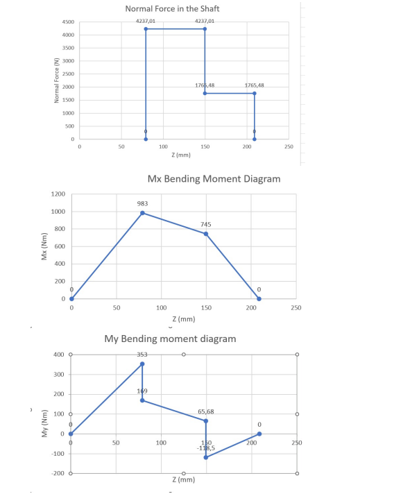
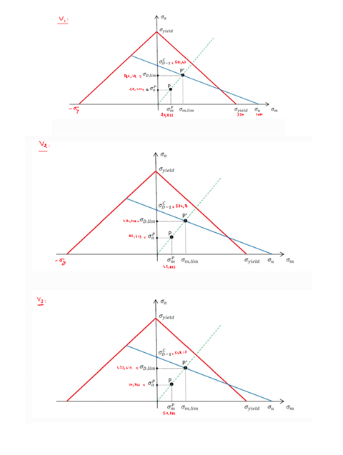
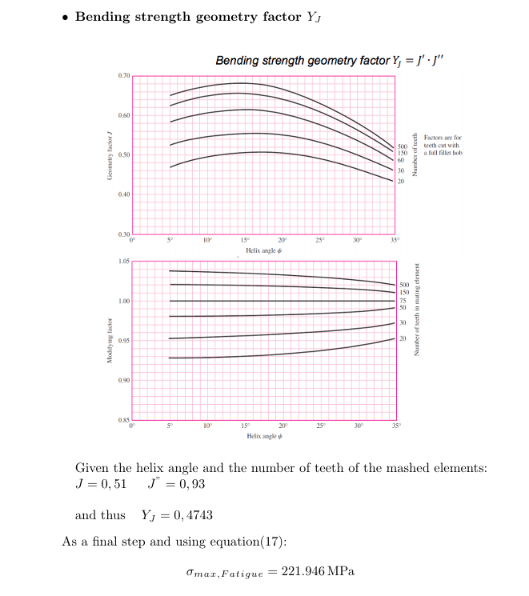
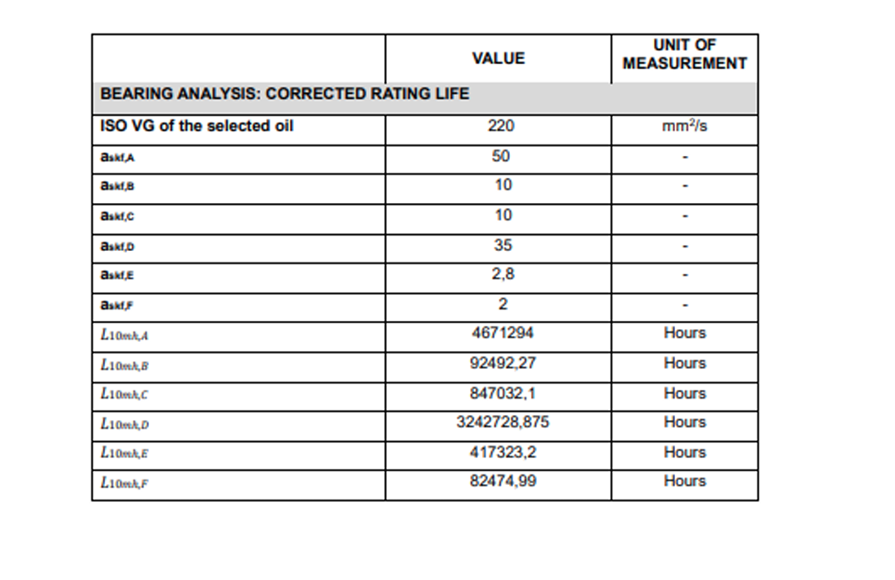

# Gearbox Machine Design Analysis

Mechanical design and verification of a helical gearbox developed as part of the **Fundamentals of Machine Design** course at **Politecnico di Torino**.

The project covers the mechanical verification workflow of the gearbox, including gear-force calculations, shaft loading, static and fatigue verification, gear-tooth strength analysis, and rolling-bearing life assessment.

---

## Project Overview

The objective of this project was to evaluate the structural integrity and mechanical performance of the main components of a helical gearbox.

The analysis includes:

- Gear torque and force calculations
- Shaft support reactions
- Internal forces and bending moments
- Torsional loading
- Shaft static stress verification
- Shaft fatigue verification
- Stress concentration effects
- Fatigue-limit correction factors
- Haigh-diagram fatigue assessment
- Gear-tooth bending verification
- Gear contact and pitting verification
- Rolling-bearing equivalent loads
- Bearing fatigue-life estimation
- Bearing static safety verification

The complete derivations and detailed calculations are available in the final project report and the supporting handwritten calculation notes.

---

## Engineering Workflow

```text
Input Power and Speed
        │
        ▼
Torque Calculation
        │
        ▼
Gear Forces
        │
        ▼
Shaft Support Reactions
        │
        ▼
Internal Forces and Moments
        │
        ▼
Shaft Stress Analysis
        │
        ├──────────────► Static Verification
        │
        └──────────────► Fatigue Verification
                              │
                              ▼
                       Haigh Diagrams

Gear Loads ───────────► Gear Tooth Verification
                              │
                              ├── Bending
                              └── Contact / Pitting

Shaft Reactions ──────► Bearing Analysis
                              │
                              ├── Rating Life
                              └── Static Safety
```

---

## Gearbox Load Analysis

The mechanical analysis starts from the transmitted power and rotational speed.

### Main Operating Values

| Parameter | Value |
| --- | ---: |
| Input power | 36 kW |
| Input torque | 229.18 N·m |
| Output torque | 2062.64 N·m |
| Gear pair 1 tangential force | 9223.9 N |
| Gear pair 1 radial force | 3475.66 N |
| Gear pair 1 axial force | 2471.53 N |
| Gear pair 2 tangential force | 15812.75 N |
| Gear pair 2 radial force | 5956.23 N |
| Gear pair 2 axial force | 4237 N |

The tangential, radial, and axial gear forces were used to determine the bearing reactions and internal shaft loading.

---

## Shaft Analysis

**Shaft A2** was selected as the critical shaft for detailed structural verification.

The shaft analysis includes:

- Support reaction forces
- Internal axial forces
- Bending moments about the principal axes
- Resultant bending moment
- Torsional moment
- Normal stress
- Bending stress
- Torsional shear stress
- Equivalent stress
- Static safety factor

### Internal Load Diagrams



For the static verification, four relevant shaft cross-sections were evaluated: **V1, V2, V3, and V4**.

Section **V4** was identified as the most critical section for static loading.

| Cross-section | Equivalent stress | Static safety factor |
| --- | ---: | ---: |
| V1 | 28.04 MPa | ≈ 33.16 |
| V2 | 46.93 MPa | ≈ 19.81 |
| V3 | 60.31 MPa | ≈ 15.42 |
| V4 | 75.93 MPa | ≈ 12.24 |

The minimum calculated static safety factor was therefore approximately **12.24**.

---

## Fatigue Verification

Fatigue verification was performed by separating the mean and alternating stress components and accounting for geometric stress concentration effects.

The fatigue analysis includes:

- Mean and alternating stresses
- Stress concentration factors
- Fatigue notch factors
- Surface-finish correction
- Size correction
- Equivalent mean stress
- Equivalent alternating stress
- Haigh-diagram verification

The surface-finish correction factor used in the analysis was:

**CF = 0.955**

### Haigh Diagrams



The calculated fatigue safety factors were:

| Cross-section | Fatigue safety factor |
| --- | ---: |
| V1 | ≈ 13.59 |
| V2 | ≈ 5.10 |
| V3 | ≈ 3.97 |
| V4 | ≈ 5.18 |

The most critical section for fatigue was **V3**, with a minimum fatigue safety factor of approximately **3.97**.

---

## Gear Tooth Verification

The gear-tooth verification focused on **pinion G3**, which was selected as the most critical gear for the analysis.

Two principal failure mechanisms were investigated:

- Tooth-root bending fatigue
- Surface contact and pitting fatigue

### Gear Bending Verification

The bending analysis considered:

- Face width
- Overload factor
- Rim-thickness factor
- Dynamic factor
- Load-distribution factor
- Size factor
- Bending-strength geometry factor
- Stress-cycle life factor
- Temperature factor
- Reliability factor

Some of the main calculated parameters are:

| Parameter | Value |
| --- | ---: |
| Face width | 56 mm |
| Overload factor K0 | 1 |
| Rim-thickness factor KB | 1 |
| Dynamic factor Kv | 1.17 |
| Load-distribution factor KH | 1.205 |
| Size factor KS | 1.095 |
| Bending geometry factor YJ | 0.4743 |



The calculated maximum tooth bending stress was approximately:

**221.95 MPa**

with a corresponding bending safety factor of approximately:

**3.78**

---

## Gear Contact and Pitting Verification

A contact-stress verification was performed to evaluate the resistance of the gear teeth to surface fatigue and pitting.

The calculated maximum contact stress was approximately:

**70.25 MPa**

The corresponding wear/contact safety factor was approximately:

**19.83**

---

## Bearing Life Analysis

The gearbox contains six analyzed bearing positions:

**A, B, C, D, E, and F**

The bearing analysis includes:

- Radial bearing loads
- Axial bearing loads
- Equivalent dynamic load
- Equivalent static load
- Dynamic load rating
- Static load rating
- Lubricant selection
- Viscosity ratio
- Life-correction factors
- Corrected rating life
- Static safety verification

### Bearing Selection

| Position | Bearing |
| --- | --- |
| A | NU 206 ECP |
| B | 30206 DF |
| C | NU 209 ECP |
| D | 32011 X/DF |
| E | NU 2210 ECP |
| F | 32011 X/DF |

For the analyzed operating conditions, the study identified **ISO VG 220** lubricant.

### Bearing Life Results



The bearing analysis evaluates the selected bearings in terms of equivalent loading, corrected rating life, and static safety under the considered operating conditions.

### Bearing Static Safety Factors

| Bearing position | Static safety factor |
| --- | ---: |
| A | ≈ 24.96 |
| B | ≈ 7.71 |
| C | ≈ 19.35 |
| D | ≈ 14.98 |
| E | ≈ 17.40 |
| F | ≈ 8.50 |

---

## Key Results

| Analysis | Result |
| --- | ---: |
| Input power | 36 kW |
| Input torque | 229.18 N·m |
| Output torque | 2062.64 N·m |
| Critical shaft | A2 |
| Critical static section | V4 |
| Maximum equivalent shaft stress | ≈ 75.93 MPa |
| Minimum shaft static safety factor | ≈ 12.24 |
| Critical fatigue section | V3 |
| Minimum shaft fatigue safety factor | ≈ 3.97 |
| Critical gear | G3 |
| Maximum gear bending stress | ≈ 221.95 MPa |
| Gear bending safety factor | ≈ 3.78 |
| Maximum gear contact stress | ≈ 70.25 MPa |
| Gear contact safety factor | ≈ 19.83 |

---

## Engineering Methods

The project applies fundamental machine-design methods including:

- Static equilibrium
- Free-body diagrams
- Shaft reaction calculations
- Internal force and moment diagrams
- Normal stress analysis
- Bending stress analysis
- Torsional stress analysis
- Equivalent stress calculation
- Static safety-factor calculation
- Fatigue stress decomposition
- Stress concentration analysis
- Fatigue-strength correction
- Haigh-diagram analysis
- Gear-tooth bending verification
- Hertzian contact verification
- Rolling-bearing life calculations
- Bearing static-load verification

---

## Repository Structure

```text
gearbox-machine-design-analysis/
│
├── README.md
│
├── report/
│   ├── README.md
│   └── gearbox_machine_design_report.pdf
│
├── calculations/
│   ├── README.md
│   └── handwritten_engineering_calculations.pdf
│
└── figures/
    ├── README.md
    ├── shaft_A2_internal_loads.png
    ├── shaft_fatigue_haigh_diagrams.png
    ├── gear_tooth_bending_verification.png
    └── bearing_life_summary.png
```

---

## Project Files

### Final Report

The complete final project report contains the detailed calculations, verification procedures, diagrams, tables, and final engineering results.

[View the Final Gearbox Design Report](report/gearbox_machine_design_report.pdf)

### Supporting Calculations

The handwritten calculation notes document the intermediate engineering derivations performed during the development of the project.

[View the Handwritten Engineering Calculations](calculations/handwritten_engineering_calculations.pdf)

> **Note:** The final project report should be considered the authoritative source for final numerical results. The handwritten notes are included as supporting working material and may contain intermediate calculations or values that were later revised.

---

## Authors

- **Mohammad Nour Edeen**

---

## Academic Context

**Course:** Fundamentals of Machine Design  
**Course Code:** 02SXJJM  
**Academic Year:** 2023/2024  
**Institution:** Politecnico di Torino  
**Professor:** Nicola Bosso  
**Teaching Staff:** Matteo Magelli and Francesco Mocera  
**Project Date:** January 2024

---

## Topics

`machine-design` `gearbox` `helical-gears` `shaft-design` `fatigue-analysis` `stress-analysis` `gear-design` `bearing-life` `mechanical-engineering` `politecnico-di-torino`
